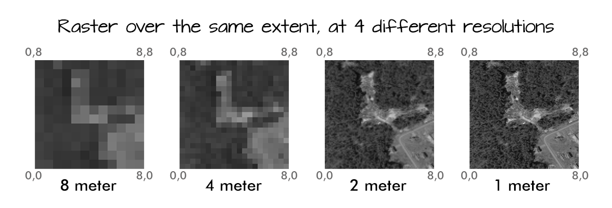

This episode reviews the two primary types of geospatial data: rasters and vectors. It provides an overview of these two types of geospatial data, describing major features of both and providing examples of where you might find each type. 

# Data Structures: Raster and Vector

Raster data is any pixelated (or gridded) data where each pixel is associated with a specific geographic location. The value of a pixel can be continuous (e.g. elevation) or categorical (e.g. land use). This data structure is very common: it's how we represent any digital image. A geospatial raster is only different from a digital photo in that it is accompanied by spatial information that connects the data to a particular location. This includes the raster's extent and cell size, the number of rows and columns, and its coordinate reference system (CRS). 

Source: National Ecological Observatory Network (NEON)
{: .text-center}

Some examples of continuous rasters include:

1. Precipitation maps
2. Maps of tree height derived from LiDAR data 
3. Elevation values for a region

Some rasters contain categorical data where each pixel represents a discrete class such as landcover type (e.g., "forest" or "grassland") rather than a continuous value such as elevation or temperature. Some examples of classified maps include:

1. Land-cover/land-use maps
2. Tree height maps classified as short, medium, and tall trees
3. Elevation maps classified as low, medium, and high elevation

Source: United States Geological Survey (USGS)
{: .text-center}

> ## Advantages and Disadvantages
> 
> With a partner, brainstorm potential advantages and disadvantages of storing data in raster format. 
> 
> > ## Solution
> > 
> > Raster data has some important advantages:
> > 
> > * representation of continuous surfaces
> > * potentially very high levels of detail
> > * data is 'unweighted' across its extent - the geometry doesn't implicitly highlight features
> > * cell-by-cell calculations can be very fast and efficient
> > 
> > The downsides of raster data are:
> > 
> > * file sizes become very large as the cell size gets smaller (more pixels)
> > * currently popular formats don't embed metadata well
> > * can be difficult to represent complex information
> {: .solution}
{: .challenge}

## Important Attributes of Raster Data

### Extent

The spatial extent is the geographic area that the raster data covers. The spatial extent of an R spatial object represents the geographic edge or location that is the furthest north, south, east, and west. In other words, extent represents the overall geographic coverage of the spatial object. 

### Resolution

A resolution of a raster represents the area on the ground that each pixel of the raster covers.

Source: National Ecological Observatory Network (NEON)
{: .text-center}

## Multi-band Raster Data
A raster can contain one or more bands. One type of multi-band raster dataset that is familiar to many of us is a color image. A basic color image consists of three bands: red, green, and blue. Each band represents light reflected from the red, green, or blue portions of the electromagnetic spectrum. The pixel brightness for each band, when composited, creates the colors that we see in an image. In a multi-band dataset, the rasters will always have the same extent, resolution, and CRS. 

Source: National Ecological Observatory Network (NEON)
{: .text-center}

## Raster Data Format for this Capstone

Raster data can come in many different formats. For this capstone, we've offered data in the GeoTIFF format, which has the extension `.tif`. A `.tif` file stores metadata or attributes about the file as embedded `.tif tags`. For instance, your camera might store a tag that describes the make and model of the camera or the date that the photo was taken when it saves a `.tif`. A GeoTIFF is a standard `.tif` image format with additional spatial (georeferencing) information embedded in the file as tags. These tags should include the following raster metadata:

1. Extent
2. Resolution
3. Coordinate Refernce System (CRS) - you'll explore this concept in a later episode. 
4. Values that represent missing data (`NoDataValue`). 

> ## Spatial Questions with Raster Data
> What kinds of geographic questions can you ask using raster data? Brainstorm a few with your neighbor or in a breakout room.
> > ## Solution
> >
> > How are precipitation patterns different across space?
> > How does average temperature differ across space?
> {: .solution}
{: .challenge}

## About Vector Data

Vector data structures represent specific features on the Earth's surface, and assign attributes to those features. Vectors are composed of discrete geometric locations (x, y values) known as vertices that define the shape of the spatial object. The organization of the vertices determines the type of vector that we are working with: point, line, or polygon. 

Source: National Ecological Observatory Network (NEON)
{: .text-center}

* **Points:** Each point is defined by a single x, y coordinate. There can be many points in a vector point file. Examples of point data include: sampling locations, the location of individual trees, or the location of survey plots. 

* **Lines:** Lines are composed of many (at least 2) points that are connected. For instance, a road or a stream may be represented by a line. This line is composed of a series of segments, each "bend" in the road or stream represents a vertex that has a defined x, y location. 

* **Polygons:** A polygon consists of 3 or more vertices that are connected and closed. The outlines of survey plot boundaries, lakes, oceans, and states or countries are often represented by polygons. 

> # Data Tip
>
> Sometimes, boundary layers such as states and countries, are stored as lines
>  rather than polygons. However, these boundaries, when represented as a line,
>  will not create a closed object with a defined area that can be filled.
{: .callout}

> ## Advantages and Disadvantages
> 
> With your neighbor, brainstorm potential advantages and disadvantages of using vector data. 
> 
> > ## Solution
> > 
> > Vector data has some important advantages:
> > 
> > * the geometry itself contains information about what the dataset creator thought was important
> > * the geometry structures hold information in themselves — why choose point over polygon, for instance?
> > * each geometry feature can carry multiple attributes instead of just one, e.g. a database of cities can have attributes for name, country, population, etc. 
> > * data storage can be very efficient compared to rasters
> > 
> > The downsides of vector data are:
> > 
> > * potential loss of detail compared to raster
> > * potential bias in datasets — what didn't get recorded?
> > * calculations involving multiple vector layers need to do math on the geometry as well as on the attributes, so can be slow compared to raster math. 
> {: .solution}
{: .challenge}

Vector datasets are in use in many industries besides geospatial fields. For instance, computer graphics are largely vector-based, although the data structures in use tend to join points using arcs and complex curves rather than straight lines. Computer-aided design (CAD) is also vector-based. The difference is that geospatial datasets are accompanied by information tying their features to real-world locations. 

## Vector Data Format for this Capstone

Like raster data, vector data can also come in many different formats. For this capstone, we'll use the Shapefile format, which has the extension `.shp`. A `.shp` file stores the geographic coordinates of each vertice in the vector, as well as metadata including:

* **Extent:** the spatial extent of the shapefile (i.e., geographic area that the shapefile covers). The spatial extent for a shapefile represents the combined extent for all spatial objects in the shapefile. 
* **Object type:** whether the shapefile includes points, lines, or polygons. 
* **Coordinate Reference System (CRS):** defines how the two-dimensional, projected map relates to real places on the earth. The decision of which map projection and CRS to use depends on the regional extent of the area you want to work in, on the analysis you want to do, and often on the availability of data.
*  **Other Attributes:** for example, a line shapefile that contains the locations of streams, might contain the name of each stream.

Because the structure of points, lines, and polygons are different, each individual shapefile can only contain one vector type (all points, all lines, or all polygons). You will not find a mixture of point, line, and polygon objects in a single shapefile. A shapefile is actually a directory of files that contain different attributes about the data — you'll learn more about this when you begin to work with vector data. 

> # More Resources
>
> More about shapefiles can be found on [Wikipedia](https://en.wikipedia.org/wiki/Shapefile)
{: .callout}

> # Why Not Both?
>
> very few formats can contain both raster and vector data - in fact, most are even more restrictive than that. Vector datasets are usually locked to one geometry type, e.g. points only. Raster datasets can usually only encode one data type; for example, you can't have a multi-band GeoTIFF where one layer is integer data and another is floating point. There are sound reasons for this: format standards are easier to define and maintain, and so is metadata. The effects of particular data manipulations are more predictable if you are confident that all of your output data has the same characteristics. 
{: .callout}

> # Research Questions for Vector Data
>
> Brainstorm potential research questions you could use vector data to answer, with a partner or in a breakout room. 
> > ## Solution
> >
> > What counties had the highest and lowest precipitation in 1990?
> > 
> {: .solution
{: .challenge}


