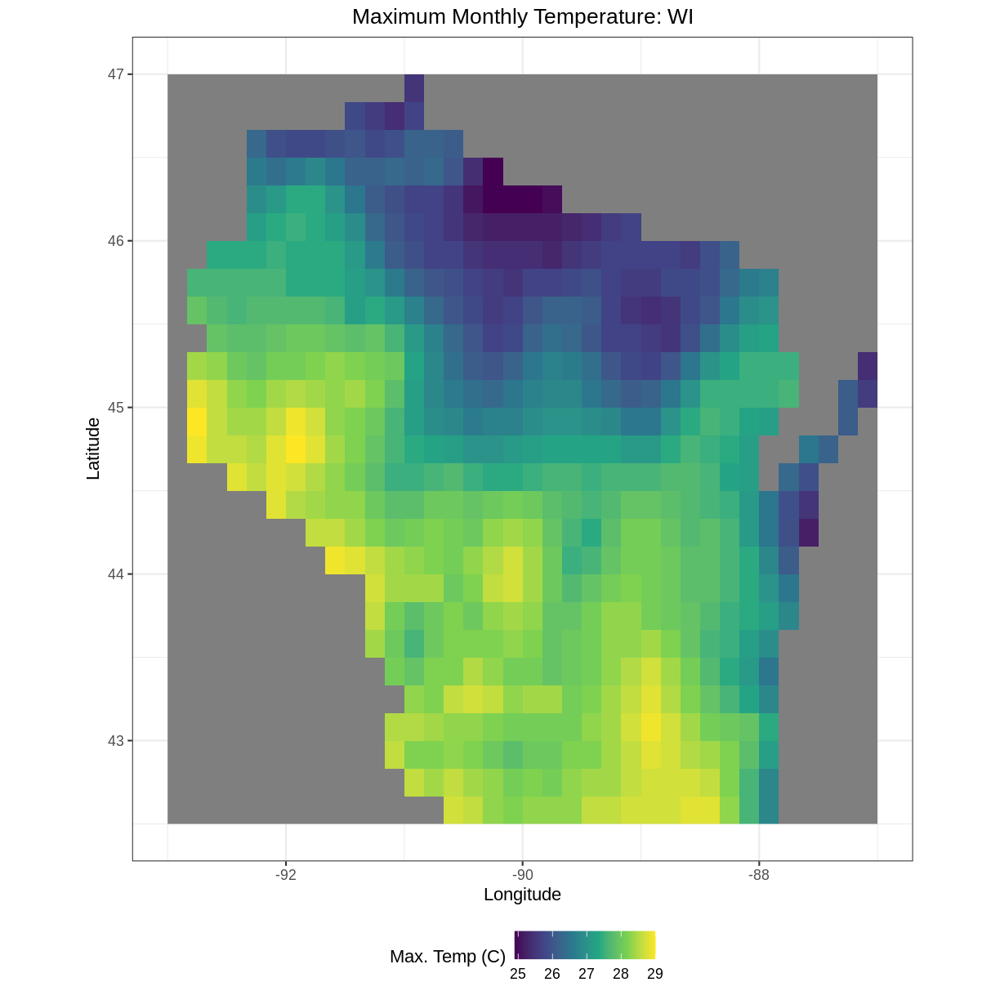

---
# Please do not edit this file directly; it is auto generated.
# Instead, please edit 03-day2.md in _episodes_rmd/
title: "Day 2: Introduction to Raster Data"
exercises: 5
questions:
- "What are the coordinate reference systems for your rasters and are they the same? "
objectives:
- "Visually explore the patterns in your rasters.  Reproject the your raster into UTM coordinates."
keypoints:
- "Always explore your raster first using the summary() and crs() functions."
- "To plot your raster with ggplot(), first convert your raster to a data frame using the as.data.frame() function and specify the argument xy=TRUE."
- "You may need to reproject your raster, for which you can use the projectRaster() function."
- "There are many plotting and aesthetics options in the ggplot2 package for you to explore."
---

# Outline

- Intro + Minute questions (10-15 min.)
- Raster Capstone (30-40 min.):
  - Load and summarize the raster data
  - Visualize the raster data
  - Develop insights
  - Reproject your raster
- Outro + Final Questions (10-15 min.)

In this capstone lesson, we use the following capstone data:

  - A raster of maximum temperature in Wisconsin
  - A raster of minimum temperature in Wisconsin
  
If you are using your own data, please identify two (2) rasters with continuous values and that are unprojected.

<!-- In this capstone lesson, we will be providing you with capstone data that include two Wisconsin rasters of 1) maximum temperature and 2) minimum temperature. If you are using your own data, please identify 2 different rasters that you can use to summarize and visualize in this lesson. The learning objectives of this capstone are to demonstrate a geospatial workflow of loading, summarizing, and plotting rasters as well as checking the CRS and projecting. -->

## 1) Load and summarize

Practice the first steps of using data by loading in the maximum and minimum temperature rasters for Wisconsin using the `raster()` function and then exploring using the `summary()` function.

> ## Solution
> 
> ~~~
> library(raster)
> ~~~
> {: .language-r}
> 
> 
> 
> ~~~
> Loading required package: sp
> ~~~
> {: .output}
> 
> 
> 
> ~~~
> library(ggplot2)
> library(rgdal)
> ~~~
> {: .language-r}
> 
> 
> 
> ~~~
> rgdal: version: 1.5-23, (SVN revision 1121)
> Geospatial Data Abstraction Library extensions to R successfully loaded
> Loaded GDAL runtime: GDAL 3.0.4, released 2020/01/28
> Path to GDAL shared files: /usr/share/gdal
> GDAL binary built with GEOS: TRUE 
> Loaded PROJ runtime: Rel. 6.3.1, February 10th, 2020, [PJ_VERSION: 631]
> Path to PROJ shared files: /usr/share/proj
> Linking to sp version:1.4-5
> To mute warnings of possible GDAL/OSR exportToProj4() degradation,
> use options("rgdal_show_exportToProj4_warnings"="none") before loading rgdal.
> ~~~
> {: .output}
> 
> 
> 
> ~~~
> mintemp <- raster("../data/mintemp_monthcold_wi.tif")
> summary(mintemp)
> ~~~
> {: .language-r}
> 
> 
> 
> ~~~
>         mintemp_monthcold_wi
> Min.                  -20.70
> 1st Qu.               -18.20
> Median                -16.70
> 3rd Qu.               -14.45
> Max.                  -11.10
> NA's                  377.00
> ~~~
> {: .output}
> 
> 
> 
> ~~~
> maxtemp <- raster("../data/maxtemp_monthwarm_wi.tif")
> summary(maxtemp)
> ~~~
> {: .language-r}
> 
> 
> 
> ~~~
>         maxtemp_monthwarm_wi
> Min.                    24.9
> 1st Qu.                 26.5
> Median                  27.6
> 3rd Qu.                 28.2
> Max.                    29.0
> NA's                   377.0
> ~~~
> {: .output}
{: .solution}

## 2) Check the CRS

Use the `crs()` function to check if the coordinate reference systems the same in these two rasters?

> ## Solution
> 
> ~~~
> mintemp
> ~~~
> {: .language-r}
> 
> 
> 
> ~~~
> class      : RasterLayer 
> dimensions : 27, 36, 972  (nrow, ncol, ncell)
> resolution : 0.1666667, 0.1666667  (x, y)
> extent     : -93, -87, 42.5, 47  (xmin, xmax, ymin, ymax)
> crs        : +proj=longlat +datum=WGS84 +no_defs 
> source     : mintemp_monthcold_wi.tif 
> names      : mintemp_monthcold_wi 
> values     : -20.7, -11.1  (min, max)
> ~~~
> {: .output}
> 
> 
> 
> ~~~
> maxtemp
> ~~~
> {: .language-r}
> 
> 
> 
> ~~~
> class      : RasterLayer 
> dimensions : 27, 36, 972  (nrow, ncol, ncell)
> resolution : 0.1666667, 0.1666667  (x, y)
> extent     : -93, -87, 42.5, 47  (xmin, xmax, ymin, ymax)
> crs        : +proj=longlat +datum=WGS84 +no_defs 
> source     : maxtemp_monthwarm_wi.tif 
> names      : maxtemp_monthwarm_wi 
> values     : 24.9, 29  (min, max)
> ~~~
> {: .output}
> OR
> 
> 
> ~~~
> crs(mintemp)
> ~~~
> {: .language-r}
> 
> 
> 
> ~~~
> CRS arguments: +proj=longlat +datum=WGS84 +no_defs 
> ~~~
> {: .output}
> 
> 
> 
> ~~~
> crs(maxtemp)
> ~~~
> {: .language-r}
> 
> 
> 
> ~~~
> CRS arguments: +proj=longlat +datum=WGS84 +no_defs 
> ~~~
> {: .output}
> 
> Yes, the CRS for both rasters is the same. Both are in longlat projection, datum WGS84.
{: .solution}

## 3) Visualize

Create visualizations of both minimum and maximum temperature rasters using the `ggplot2` package.

> ## Solution
> 
> ~~~
> mintemp_df <- as.data.frame(mintemp, xy=TRUE)
> maxtemp_df <- as.data.frame(maxtemp, xy=TRUE)
> ~~~
> {: .language-r}
> 
> 
> ~~~
> ggplot() +
>    geom_raster(data = mintemp_df , aes(x = x, y = y, fill = mintemp_monthcold_wi)) +
>    scale_fill_viridis_c() +
>    coord_quickmap()
> ~~~
> {: .language-r}
> 
> 
>
> 
> ~~~
> ggplot() +
>    geom_raster(data = maxtemp_df , aes(x = x, y = y, fill = maxtemp_monthwarm_wi)) +
>    scale_fill_viridis_c() +
>    coord_quickmap()
> ~~~
> {: .language-r}
> 
> 
{: .solution}

### Bonus

You can add the following aesthetics to a `ggplot` to customize the backgrounds, axis labels, title, legend label, and move the legend position to the bottom of the plot:

~~~
ggplot() +
    geom_*() +
    labs(title = "Your Title", x="X Label", y="Y Label", fill="Legend Label") +
    theme_bw() +
    theme(plot.title = element_text(hjust = 0.5), legend.position = "bottom")
~~~
{: .language-r}

Explore what these aesthetics do with your plot of maximum monthly temperature.

> ## Solution
> 
> ~~~
> ggplot() +
>    geom_raster(data = maxtemp_df , aes(x = x, y = y, fill = maxtemp_monthwarm_wi)) +
>    scale_fill_viridis_c() +
>    coord_quickmap() +
>    labs(title = "Maximum Monthly Temperature: WI", x="Longitude", y="Latitude", fill="Max. Temp (C)") +
>    theme_bw() +
>    theme(plot.title = element_text(hjust = 0.5), legend.position = "bottom")
> ~~~
> {: .language-r}
> 
> 
{: .solution}

## 4) Develop insights

Describe what patterns you observe across the state for coldest and warmest monthly temperatures in Wisconsin. What do you hypothesize is the effect of Lake Michigan?

> ## Solution
> Warmer temperatures are in Wisconsin tend toward the lower half of the state and nearer to the Minnesota border. Colder temperatures tend toward the North and near Lake Michigan, possibly due to the lake effect
>
{: .solution}

## 5) Reproject

Reproject the maxtemp raster into UTM coordinates using the following crs string: ` +proj=utm +zone=15 +datum=WGS84 +units=m +no_defs +ellps=WGS84 +towgs84=0,0,0 `.  This string was obtained from [Spatial Reference Orig](https://spatialreference.org/) under [PROJ4](https://spatialreference.org/ref/epsg/wgs-84-utm-zone-15n/proj4/).

> ## Solution
> 
> ~~~
> maxtemp_utm <- projectRaster(maxtemp, crs=" +proj=utm +zone=15 +datum=WGS84 +units=m +no_defs +ellps=WGS84 +towgs84=0,0,0 ")
> crs(maxtemp_utm)
> ~~~
> {: .language-r}
> 
> 
> 
> ~~~
> CRS arguments:
>  +proj=utm +zone=15 +datum=WGS84 +units=m +no_defs 
> ~~~
> {: .output}
> 
> 
> 
> ~~~
> crs(maxtemp)
> ~~~
> {: .language-r}
> 
> 
> 
> ~~~
> CRS arguments: +proj=longlat +datum=WGS84 +no_defs 
> ~~~
> {: .output}
{: .solution}
