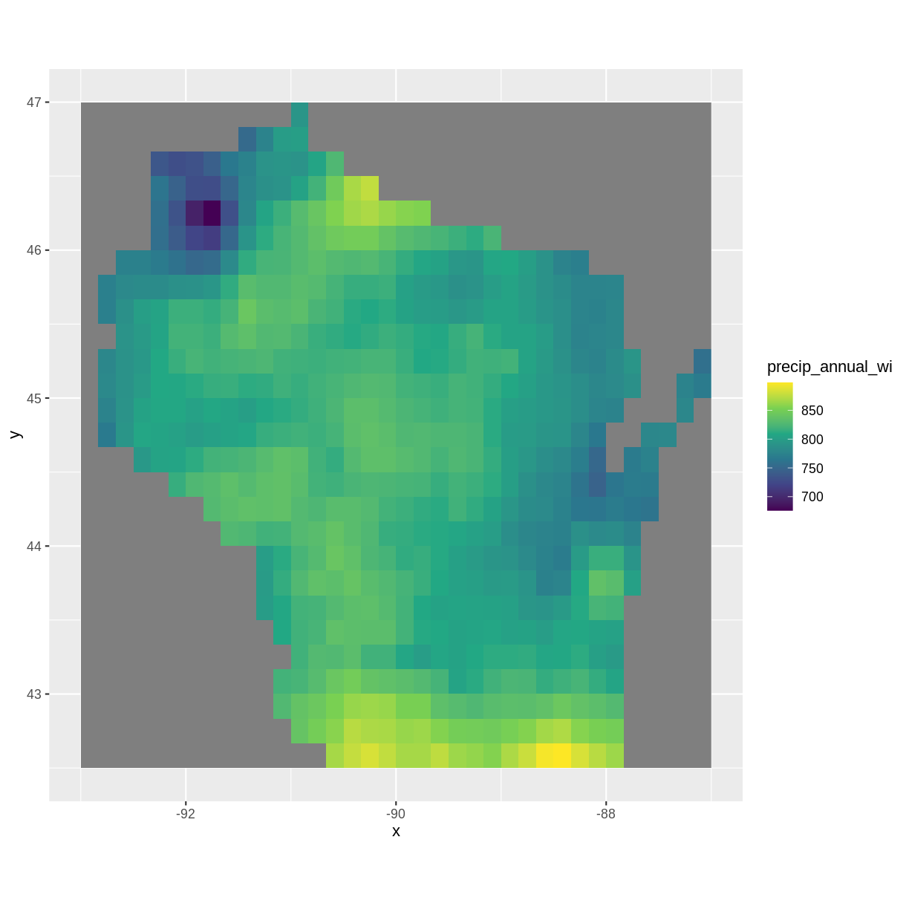

---
# Please do not edit this file directly; it is auto generated.
# Instead, please edit 04-day3.md in _episodes_rmd/
title: "Day 3: Introduction to Raster Data"
exercises: 3
questions:
- "What is the average of the minimum and maximum temperatures in Wisconsin and what patterns do you observe?"
objectives:
- "Import and explore multiple rasters and develop initial geospatial insights.  Use raster math to to calculate different summary statistics."
- "Load in the precipitation raster and explore the raster, describe the patterns you observe. Load in the maximum and minimum temperature rasters and perform raster math."
keypoints:
- "Always explore your data and note initial geospatial insights."
- "The overlay() function can be used to calculate different summary statistics for your raster."
- "With the overlay() function, you can begin to develop your skills in writing functions."
---

In this capstone lesson, we will be 3 Wisconsin rasters of 1) precipitation, 2) maximum temperature, 3) minimum temperature. We will be using the precipitation raster to review plotting rasters using `ggplot()` and maximum and minimum temperature rasters to perform raster math on. If you are using your own data, please identify at least 2 different rasters that you can use to perform raster math on - you can use the same raster to perform the raster plotting in part (1). The learning objectives of this capstone are to review importing plotting rasters with the ggplot2 package and developing initial geospatial insights, to use the `overlay()` function to calculate summary statistics of your two rasters, and to reinforce writing functions in the `overlay()` function.

## 1) Load, summarize, and visualize

Load in the precipitation raster for Wisconsin and explore the raster. Plot the raster and describe the patterns you observe.

> ## Solution
> 
> ~~~
> library(raster)
> ~~~
> {: .language-r}
> 
> 
> 
> ~~~
> Error in library(raster): there is no package called 'raster'
> ~~~
> {: .error}
> 
> 
> 
> ~~~
> library(ggplot2)
> library(rgdal)
> ~~~
> {: .language-r}
> 
> 
> 
> ~~~
> Loading required package: sp
> ~~~
> {: .output}
> 
> 
> 
> ~~~
> rgdal: version: 1.5-23, (SVN revision 1121)
> Geospatial Data Abstraction Library extensions to R successfully loaded
> Loaded GDAL runtime: GDAL 3.0.4, released 2020/01/28
> Path to GDAL shared files: /usr/share/gdal
> GDAL binary built with GEOS: TRUE 
> Loaded PROJ runtime: Rel. 6.3.1, February 10th, 2020, [PJ_VERSION: 631]
> Path to PROJ shared files: /usr/share/proj
> Linking to sp version:1.4-5
> To mute warnings of possible GDAL/OSR exportToProj4() degradation,
> use options("rgdal_show_exportToProj4_warnings"="none") before loading rgdal.
> ~~~
> {: .output}
> 
> 
> 
> ~~~
> precip <- raster("../data/precip_annual_wi.tif")
> ~~~
> {: .language-r}
> 
> 
> 
> ~~~
> Error in raster("../data/precip_annual_wi.tif"): could not find function "raster"
> ~~~
> {: .error}
> 
> 
> 
> ~~~
> summary(precip)
> ~~~
> {: .language-r}
> 
> 
> 
> ~~~
>    Min. 1st Qu.  Median    Mean 3rd Qu.    Max. 
>    7.00   29.38   36.60   34.89   42.77   67.00 
> ~~~
> {: .output}
> 
> 
> 
> ~~~
> precip_df <- as.data.frame(precip, xy=TRUE)
> ggplot() +
>  geom_raster(data=precip_df,
>              aes(x=x, y=y,fill=precip_annual_wi))+
>  scale_fill_viridis_c() +
>  coord_quickmap()
> ~~~
> {: .language-r}
> 
> 
> 
> ~~~
> Error in FUN(X[[i]], ...): object 'x' not found
> ~~~
> {: .error}
> 
> 
> 
> Annual precipitation is highest near the Illinois border and near Iron county. It is lowest near Douglas and Washburn county.
{: .solution}

## 2) Raster math using `overlay()`: calculating the difference

Load in the maximum and minimum temperature rasters  for Wisconsin. Subtract the minimum temperature from the maximum temperature using the `overlay()` function and plot your results. Note what you observe.

> ## Solution
> 
> ~~~
> mintemp <- raster("../data/mintemp_monthcold_wi.tif")
> ~~~
> {: .language-r}
> 
> 
> 
> ~~~
> Error in raster("../data/mintemp_monthcold_wi.tif"): could not find function "raster"
> ~~~
> {: .error}
> 
> 
> 
> ~~~
> maxtemp <- raster("../data/maxtemp_monthwarm_wi.tif")
> ~~~
> {: .language-r}
> 
> 
> 
> ~~~
> Error in raster("../data/maxtemp_monthwarm_wi.tif"): could not find function "raster"
> ~~~
> {: .error}
> 
> 
> 
> ~~~
> diff <- overlay(maxtemp, mintemp,
>                        fun = function(r1, r2) { return( r1 - r2) })
> ~~~
> {: .language-r}
> 
> 
> 
> ~~~
> Error in overlay(maxtemp, mintemp, fun = function(r1, r2) {: could not find function "overlay"
> ~~~
> {: .error}
> 
> 
> 
> ~~~
> diff_df <- as.data.frame(diff, xy=TRUE)
> ~~~
> {: .language-r}
> 
> 
> 
> ~~~
> Error in as.data.frame.default(diff, xy = TRUE): cannot coerce class '"function"' to a data.frame
> ~~~
> {: .error}
> 
> 
> 
> ~~~
> ggplot() +
>   geom_raster(data = diff_df, 
>               aes(x = x, y = y, fill = layer)) + 
>   scale_fill_gradientn(name = "Temperature Difference", colors = terrain.colors(10)) + 
>   coord_quickmap()
> ~~~
> {: .language-r}
> 
> 
> 
> ~~~
> Error in fortify(data): object 'diff_df' not found
> ~~~
> {: .error}
> 
> Near Lake Michigan, the difference between maximum and minimum temperature was lowest, again possibly due to the lake effect. The largest differences in maximum and minimum temperatures was near the Minnesota border.
{: .solution}

## 3) Raster math using `overlay()`: calculating the average

Use the `overlay()` function again to calculate the average temperature, using the maximum and minimum temperature rasters. Plot your results and note what you observe.

> ## Solution
> 
> ~~~
> avg <- overlay(maxtemp, mintemp, 
>               fun = function(r1, r2) { return( (r1 + r2)/2) })
> ~~~
> {: .language-r}
> 
> 
> 
> ~~~
> Error in overlay(maxtemp, mintemp, fun = function(r1, r2) {: could not find function "overlay"
> ~~~
> {: .error}
> 
> 
> 
> ~~~
> #alternative:
> #avg <- overlay(maxtemp, mintemp, fun = mean)
> 
> avg_df <- as.data.frame(avg, xy=TRUE)
> ~~~
> {: .language-r}
> 
> 
> 
> ~~~
> Error in as.data.frame(avg, xy = TRUE): object 'avg' not found
> ~~~
> {: .error}
> 
> 
> 
> ~~~
> ggplot() +
>   geom_raster(data = avg_df, 
>               aes(x = x, y = y, fill = layer)) + 
>   scale_fill_gradientn(name = "Temperature Average", colors = terrain.colors(10)) + 
>   coord_quickmap()
> ~~~
> {: .language-r}
> 
> 
> 
> ~~~
> Error in fortify(data): object 'avg_df' not found
> ~~~
> {: .error}
> 
> The average temperatures are higher toward the Illinois border and lower up north.
{: .solution}

