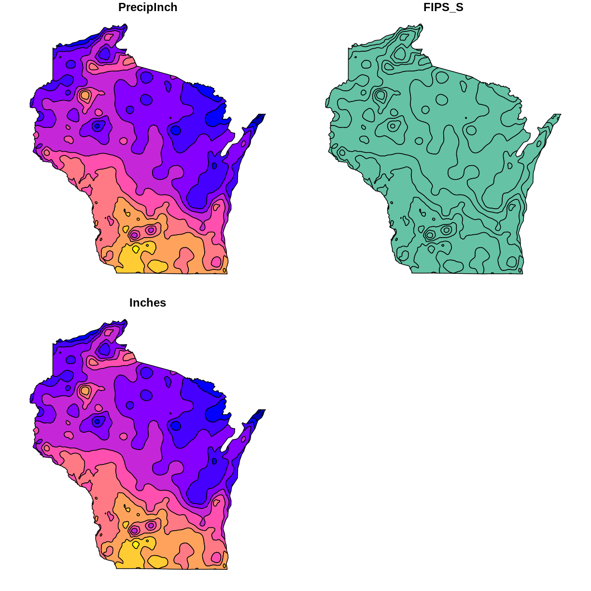
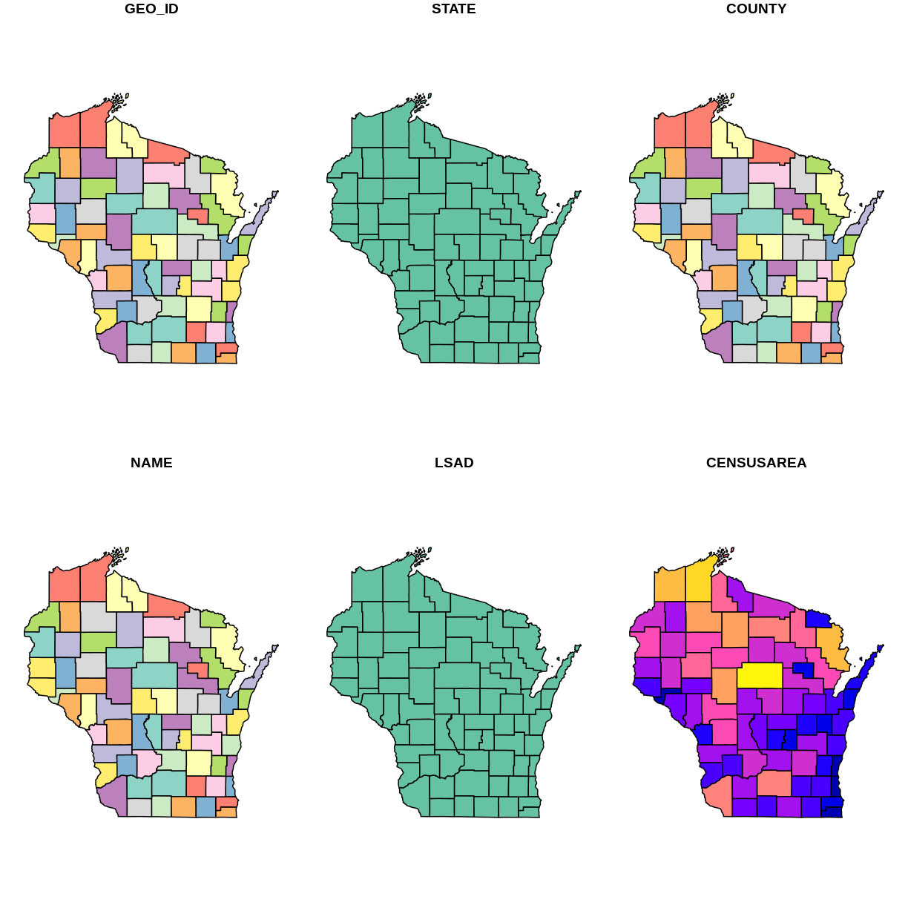
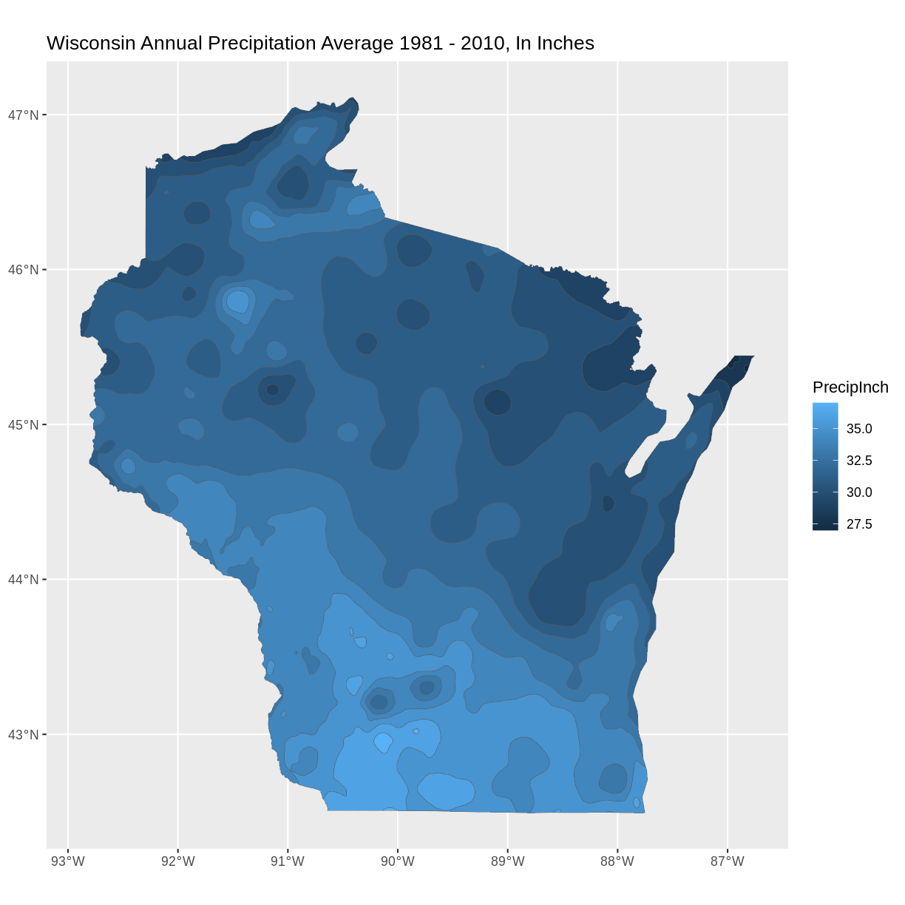
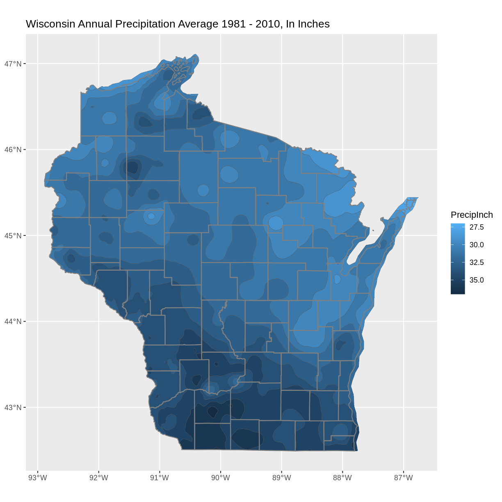
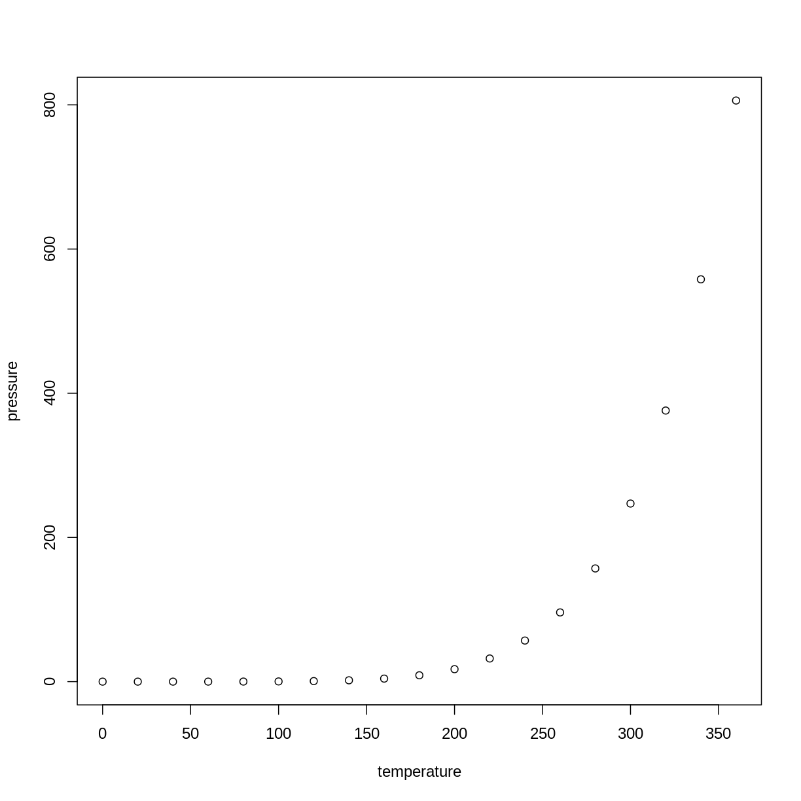

---
# Please do not edit this file directly; it is auto generated.
# Instead, please edit 05-day4.md in _episodes_rmd/
title: 'Day 4: Exploring Vector Data'
output: html_document
objectives:
- "Importing vector data; exploring vector data through attributes and by plotting"
---

## Libraries 
Load these libraries if you don't already have them (dplyr, ggplot2, sf, rgdal)

~~~
library(dplyr)
~~~
{: .language-r}

~~~

Attaching package: 'dplyr'
~~~
{: .output}

~~~
The following objects are masked from 'package:stats':

    filter, lag
~~~
{: .output}

~~~
The following objects are masked from 'package:base':

    intersect, setdiff, setequal, union
~~~
{: .output}

~~~
library(ggplot2)
library(sf)
~~~
{: .language-r}

~~~
Linking to GEOS 3.8.0, GDAL 3.0.4, PROJ 6.3.1
~~~
{: .output}

~~~
library(rgdal)
~~~
{: .language-r}

~~~
Loading required package: sp
~~~
{: .output}

~~~
rgdal: version: 1.5-23, (SVN revision 1121)
Geospatial Data Abstraction Library extensions to R successfully loaded
Loaded GDAL runtime: GDAL 3.0.4, released 2020/01/28
Path to GDAL shared files: /usr/share/gdal
GDAL binary built with GEOS: TRUE 
Loaded PROJ runtime: Rel. 6.3.1, February 10th, 2020, [PJ_VERSION: 631]
Path to PROJ shared files: /usr/share/proj
Linking to sp version:1.4-5
To mute warnings of possible GDAL/OSR exportToProj4() degradation,
use options("rgdal_show_exportToProj4_warnings"="none") before loading rgdal.
~~~
{: .output}

## Load vector files
In this exercise, we have provided two vector data files: Wisconsin Annual Precipitation Average 1981-2010, and county outlines. You can work with these, or with your own vector datasets.

~~~
wi_precip <- st_read("../data/precipitation/precip1981_2010_a_wi.shp")
~~~
{: .language-r}

~~~
Reading layer `precip1981_2010_a_wi' from data source `/home/runner/work/geospatial-capstone/geospatial-capstone/data/precipitation/precip1981_2010_a_wi.shp' using driver `ESRI Shapefile'
Simple feature collection with 11 features and 3 fields
Geometry type: MULTIPOLYGON
Dimension:     XY
Bounding box:  xmin: -92.88943 ymin: 42.49172 xmax: -86.75393 ymax: 47.11257
Geodetic CRS:  WGS 84
~~~
{: .output}

~~~
wi_county <- st_read("../data/WI_Counties2010/WI_Counties2010.shp")
~~~
{: .language-r}

~~~
Reading layer `WI_Counties2010' from data source `/home/runner/work/geospatial-capstone/geospatial-capstone/data/WI_Counties2010/WI_Counties2010.shp' using driver `ESRI Shapefile'
Simple feature collection with 72 features and 6 fields
Geometry type: MULTIPOLYGON
Dimension:     XY
Bounding box:  xmin: -92.88811 ymin: 42.49192 xmax: -86.80542 ymax: 47.08001
Geodetic CRS:  WGS 84
~~~
{: .output}

~~~
## County data is from here https://geo.btaa.org/catalog/4E677AF3-3FF2-43FA-8A58-3C345EC7F465
~~~
{: .language-r}

## Explore metadata
We have worked with commands to explore the geometry type, and projection of vector data files. Examples include:`st_geometry_type`, `st_crs`,  `st_bbox` 
Explore the metadata of the shapefiles. We will work towards comnining these files in the same plot. Are these files suited to being plotted together? 

~~~
st_geometry_type(wi_precip)
~~~
{: .language-r}

~~~
 [1] MULTIPOLYGON MULTIPOLYGON MULTIPOLYGON MULTIPOLYGON MULTIPOLYGON
 [6] MULTIPOLYGON MULTIPOLYGON MULTIPOLYGON MULTIPOLYGON MULTIPOLYGON
[11] MULTIPOLYGON
18 Levels: GEOMETRY POINT LINESTRING POLYGON MULTIPOINT ... TRIANGLE
~~~
{: .output}

~~~
st_crs(wi_precip)$proj4string
~~~
{: .language-r}

~~~
[1] "+proj=longlat +datum=WGS84 +no_defs"
~~~
{: .output}

~~~
st_bbox(wi_precip)
~~~
{: .language-r}

~~~
     xmin      ymin      xmax      ymax 
-92.88943  42.49172 -86.75393  47.11257 
~~~
{: .output}

~~~
st_geometry_type(wi_county)
~~~
{: .language-r}

~~~
 [1] MULTIPOLYGON MULTIPOLYGON MULTIPOLYGON MULTIPOLYGON MULTIPOLYGON
 [6] MULTIPOLYGON MULTIPOLYGON MULTIPOLYGON MULTIPOLYGON MULTIPOLYGON
[11] MULTIPOLYGON MULTIPOLYGON MULTIPOLYGON MULTIPOLYGON MULTIPOLYGON
[16] MULTIPOLYGON MULTIPOLYGON MULTIPOLYGON MULTIPOLYGON MULTIPOLYGON
[21] MULTIPOLYGON MULTIPOLYGON MULTIPOLYGON MULTIPOLYGON MULTIPOLYGON
[26] MULTIPOLYGON MULTIPOLYGON MULTIPOLYGON MULTIPOLYGON MULTIPOLYGON
[31] MULTIPOLYGON MULTIPOLYGON MULTIPOLYGON MULTIPOLYGON MULTIPOLYGON
[36] MULTIPOLYGON MULTIPOLYGON MULTIPOLYGON MULTIPOLYGON MULTIPOLYGON
[41] MULTIPOLYGON MULTIPOLYGON MULTIPOLYGON MULTIPOLYGON MULTIPOLYGON
[46] MULTIPOLYGON MULTIPOLYGON MULTIPOLYGON MULTIPOLYGON MULTIPOLYGON
[51] MULTIPOLYGON MULTIPOLYGON MULTIPOLYGON MULTIPOLYGON MULTIPOLYGON
[56] MULTIPOLYGON MULTIPOLYGON MULTIPOLYGON MULTIPOLYGON MULTIPOLYGON
[61] MULTIPOLYGON MULTIPOLYGON MULTIPOLYGON MULTIPOLYGON MULTIPOLYGON
[66] MULTIPOLYGON MULTIPOLYGON MULTIPOLYGON MULTIPOLYGON MULTIPOLYGON
[71] MULTIPOLYGON MULTIPOLYGON
18 Levels: GEOMETRY POINT LINESTRING POLYGON MULTIPOINT ... TRIANGLE
~~~
{: .output}

~~~
st_crs(wi_county)$proj4string
~~~
{: .language-r}

~~~
[1] "+proj=longlat +datum=WGS84 +no_defs"
~~~
{: .output}

~~~
st_bbox(wi_county)
~~~
{: .language-r}

~~~
     xmin      ymin      xmax      ymax 
-92.88811  42.49192 -86.80541  47.08001 
~~~
{: .output}

## Explore attributes. Identify attribute(s) of interest
If you are working with our provided data, identify the attribute that appears to contain the precipitation data, and the attribute of county name. If you are working with your own data, choose an attribute of interest to work with for plotting.
There are multiple ways to explore the attributes of a spatial data file. We have worked with the `names` function and previewing the first 6 rows with the `head` functions as well as viewing the file in RStudio's Environment tab, or printing the shapefile object to the screen.

For a visual method to explore attributes, you can try the `plot` function built into sf. This plots a small map for each of the attributes. For example 
`plot(wi_precip)`
Notice that this plot command does not display data values

~~~
plot(wi_precip)
~~~
{: .language-r}

~~~
plot(wi_county)
~~~
{: .language-r}

## Using ggplot2 to plot data with selected attribute of interest
If working with our data,  plot the precipitation shapefile using the atribute you identified as the precipitation data to set the fill. One way to do this is to use a fill aesthetic mapped to the column name of the attribute you identified `aes(fill = Use the attribute Column Name)`

~~~
# Using aes in  ggplot2 
ggplot() +
  geom_sf(data = wi_precip, aes(fill = PrecipInch), size = 0.1) +
  ggtitle("Wisconsin Annual Precipitation Average 1981 - 2010, In Inches") +
  coord_sf()
~~~
{: .language-r}

## Discussion 
What do you see? For example, where are the highest/lowest values, and are there patterns across the state? How many different categories are there?
Notice the default colors and how they are associated with the data values. Do you think this color scale is a good choice for the data?
Can you easily read the different color values on the plot, and connect them to the  value? Is the color range intuitive to understand? Could this be symbolized better?

One option is to reverse the color range, so the darker colors correspond to higher values. Add the line `scale_fill_continuous(trans = 'reverse') +`

~~~
#Plot a shapefile, reverse the colors
ggplot() +
  geom_sf(data = wi_precip, aes(fill = PrecipInch), size = 0.1) +
  scale_fill_continuous(trans = 'reverse') +   ## reverses color scale     
  ggtitle("Wisconsin Annual Precipitation Average 1981 - 2010, In Inches") +
  coord_sf()
~~~
{: .language-r}

## Plot multiple vector shapefiles
You can use ggplot2 to plot mutiple vector shapefiles layered in a single plot.

~~~
ggplot() +
  geom_sf(data = wi_precip, aes(fill = PrecipInch), size = 0.1) +
  #scale_fill_manual(values = myColors)
geom_sf(data = wi_county, fill = NA, color = gray(.5)) +  
  scale_fill_continuous(trans = 'reverse') +        ## reverses color scale
  ggtitle("Wisconsin Annual Precipitation Average 1981 - 2010, In Inches") +
  coord_sf()
~~~
{: .language-r}

##Delete the default text below

> ## Challenge Title
>
> This is the body of the challenge.
>
> ~~~
> it may include some code
> ~~~
> {: .source}
>
> > ## Solution
> >
> > This is the body of the solution.
> >
> > ~~~
> > it may also include some code
> > ~~~
> > {: .output}
> {: .solution}
{: .challenge}

#### R Markdown ---- Delete the below default Markdown text

This is an R Markdown document. Markdown is a simple formatting syntax for authoring HTML, PDF, and MS Word documents. For more details on using R Markdown see <http://rmarkdown.rstudio.com>.

When you click the **Knit** button a document will be generated that includes both content as well as the output of any embedded R code chunks within the document. You can embed an R code chunk like this:

~~~
summary(cars)
~~~
{: .language-r}

~~~
     speed           dist       
 Min.   : 4.0   Min.   :  2.00  
 1st Qu.:12.0   1st Qu.: 26.00  
 Median :15.0   Median : 36.00  
 Mean   :15.4   Mean   : 42.98  
 3rd Qu.:19.0   3rd Qu.: 56.00  
 Max.   :25.0   Max.   :120.00  
~~~
{: .output}

## Including Plots

You can also embed plots, for example:

Note that the `echo = FALSE` parameter was added to the code chunk to prevent printing of the R code that generated the plot.
