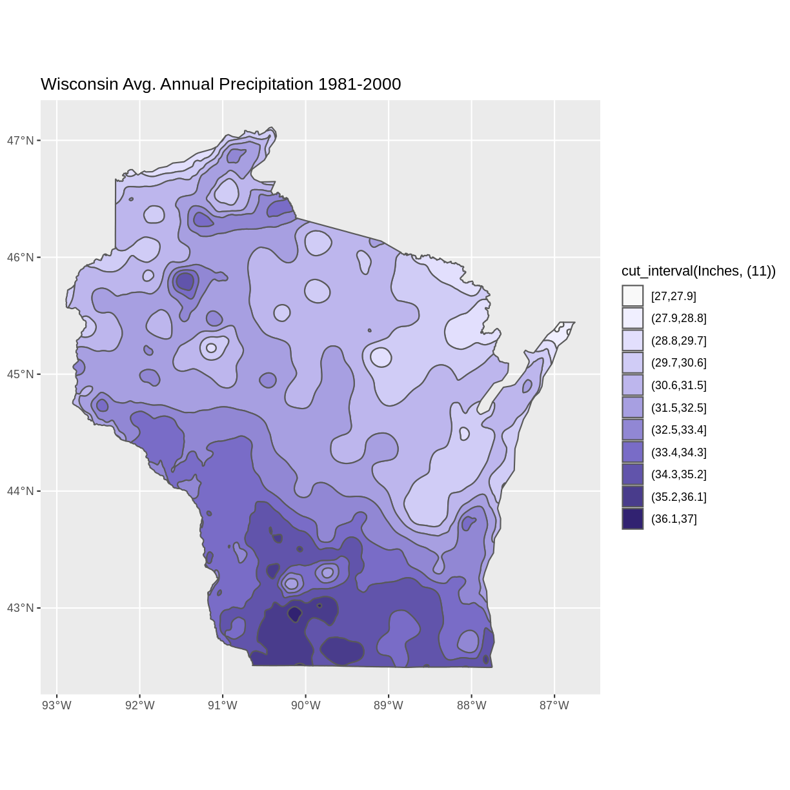
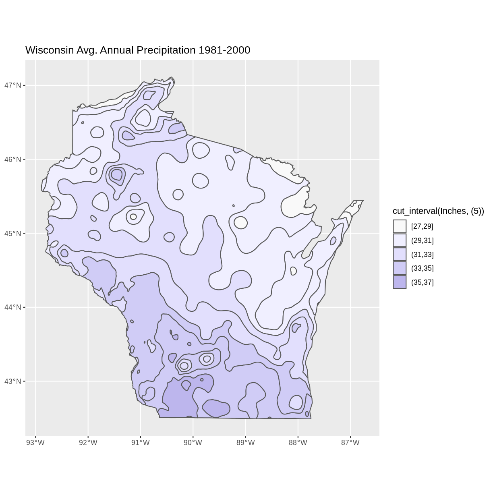
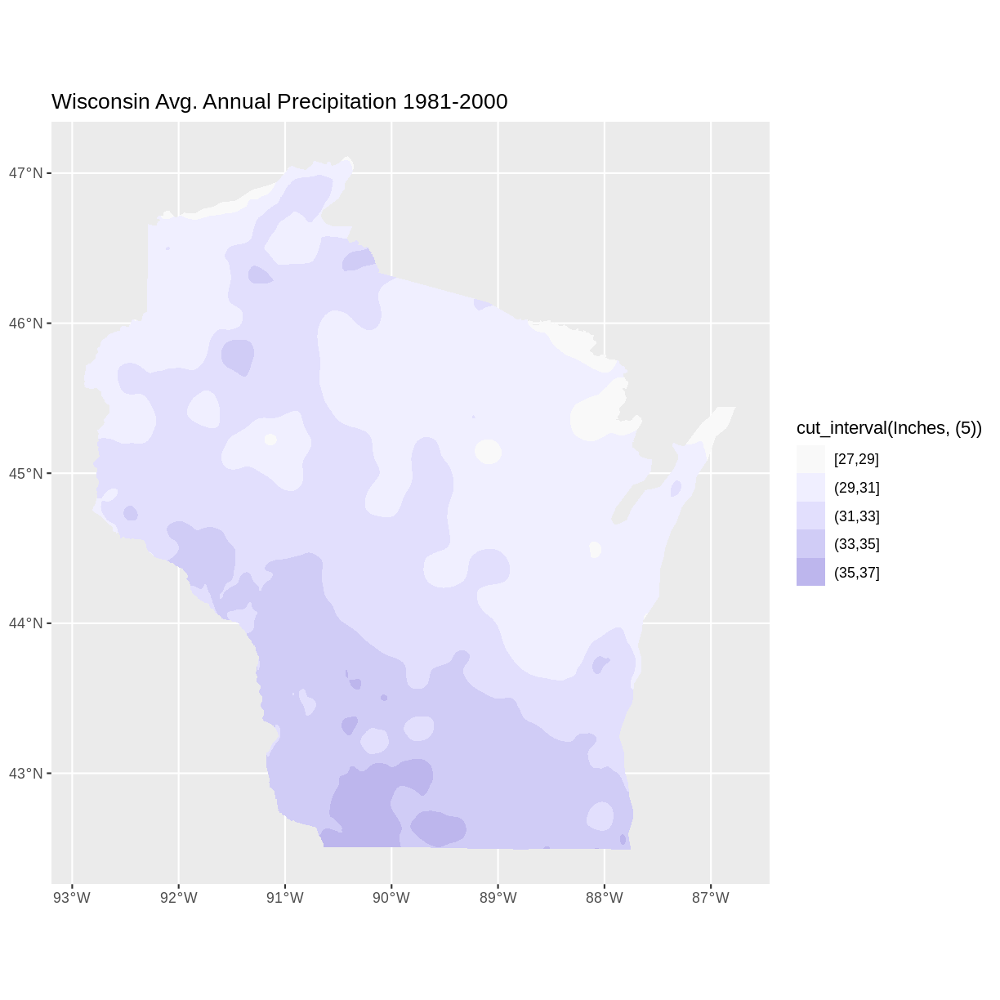

---
# Please do not edit this file directly; it is auto generated.
# Instead, please edit 05-day4.md in _episodes_rmd/
title: 'Day 4: Exploring Vector Data'
exercises: 7
questions: 
- "Are two datasets from two different sources suitable to be plotted together?" 
- "What spatial patterns can we see by visual analysis?"  
- "What are some plotting options to impact the way data are visualized?" 
output: html_document
objectives:
- "Importing vector data and visually explore the vector data through attributes and by visualization."
keypoints: 
 - "-	Options for exploring vector files include displaying metadata, and visually examining plots"
 - "-	R offers design options for the visual display of vector data, including choosing a color palette, and reversing the order of colors assigned to categories"

---

In this capstone lesson, we will work with two Wisconsin vector data files: precipitation, and county boundaries. If you are using your own data, please identify 2 different vector files that you can use to summarize and visualize in this lesson. The learning objectives of this capstone are to demonstrate an example workflow of loading, exploring, and plotting vectors. 

## 1) Load Libraries 
Load these libraries if you don't already have them (`dplyr`, `ggplot2`, `sf`, `rgdal`)

> ## Solution
> 
> ~~~
> library(dplyr)
> ~~~
> {: .language-r}
> 
> 
> 
> ~~~
> Error in library(dplyr): there is no package called 'dplyr'
> ~~~
> {: .error}
> 
> 
> 
> ~~~
> library(ggplot2)
> library(sf)
> ~~~
> {: .language-r}
> 
> 
> 
> ~~~
> Linking to GEOS 3.8.0, GDAL 3.0.4, PROJ 6.3.1
> ~~~
> {: .output}
> 
> 
> 
> ~~~
> library(rgdal)
> ~~~
> {: .language-r}
> 
> 
> 
> ~~~
> Loading required package: sp
> ~~~
> {: .output}
> 
> 
> 
> ~~~
> rgdal: version: 1.5-23, (SVN revision 1121)
> Geospatial Data Abstraction Library extensions to R successfully loaded
> Loaded GDAL runtime: GDAL 3.0.4, released 2020/01/28
> Path to GDAL shared files: /usr/share/gdal
> GDAL binary built with GEOS: TRUE 
> Loaded PROJ runtime: Rel. 6.3.1, February 10th, 2020, [PJ_VERSION: 631]
> Path to PROJ shared files: /usr/share/proj
> Linking to sp version:1.4-5
> To mute warnings of possible GDAL/OSR exportToProj4() degradation,
> use options("rgdal_show_exportToProj4_warnings"="none") before loading rgdal.
> ~~~
> {: .output}
{: .solution}

## 2) Load vector files
In this exercise, we have provided two capstone vector data files: Wisconsin Annual Precipitation Average 1981-2010, and county outlines. You can work with these, or with your own vector datasets.

Filenames: precip1981_2010_a_wi.shp  and  WI_Counties2010.shp

## Note about the Shapefile format
>
> Although we will be importing Shapefiles using the name of a single file with the extension ".shp" be aware that a Shapefile actually consists of a folder of multiple files, each having the same name but with different extensions. The multiple files in the folder each contain information about different aspects of the geospatial data.
> For more information see "What is a Shapefile?" https://www.gislounge.com/what-is-a-shapefile/
{: .callout}

> ## Solution
> 
> ~~~
> wi_precip <- st_read("../data/precipitation/precip1981_2010_a_wi.shp")
> ~~~
> {: .language-r}
> 
> 
> 
> ~~~
> Reading layer `precip1981_2010_a_wi' from data source 
>   `/home/runner/work/geospatial-capstone/geospatial-capstone/data/precipitation/precip1981_2010_a_wi.shp' 
>   using driver `ESRI Shapefile'
> Simple feature collection with 11 features and 3 fields
> Geometry type: MULTIPOLYGON
> Dimension:     XY
> Bounding box:  xmin: -92.88943 ymin: 42.49172 xmax: -86.75393 ymax: 47.11257
> Geodetic CRS:  WGS 84
> ~~~
> {: .output}
> 
> 
> 
> ~~~
> wi_county <- st_read("../data/WI_Counties2010/WI_Counties2010.shp")
> ~~~
> {: .language-r}
> 
> 
> 
> ~~~
> Reading layer `WI_Counties2010' from data source 
>   `/home/runner/work/geospatial-capstone/geospatial-capstone/data/WI_Counties2010/WI_Counties2010.shp' 
>   using driver `ESRI Shapefile'
> Simple feature collection with 72 features and 6 fields
> Geometry type: MULTIPOLYGON
> Dimension:     XY
> Bounding box:  xmin: -92.88811 ymin: 42.49192 xmax: -86.80542 ymax: 47.08001
> Geodetic CRS:  WGS 84
> ~~~
> {: .output}
> 
> 
> 
> ~~~
> ## County data is from here  https://geo.btaa.org/catalog/4E677AF3-3FF2-43FA-8A58-3C345EC7F465
> ~~~
> {: .language-r}
{: .solution}

## 3) Explore metadata
We have worked with functions to explore the geometry type, and projection of vector data files. Examples include:`st_geometry_type()`, `st_crs()`,  `st_bbox()`, as well as reviewing the output produced in R when you imported the shapefiles. 

Explore the metadata of the shapefiles. We will work towards combining these files in the same plot. Are these files suited to being plotted together - for example, are they in the same CRS and cover the same area? 

> ## Solution
> 
> ~~~
> st_geometry_type(wi_precip)
> ~~~
> {: .language-r}
> 
> 
> 
> ~~~
>  [1] MULTIPOLYGON MULTIPOLYGON MULTIPOLYGON MULTIPOLYGON MULTIPOLYGON
>  [6] MULTIPOLYGON MULTIPOLYGON MULTIPOLYGON MULTIPOLYGON MULTIPOLYGON
> [11] MULTIPOLYGON
> 18 Levels: GEOMETRY POINT LINESTRING POLYGON MULTIPOINT ... TRIANGLE
> ~~~
> {: .output}
> 
> 
> 
> ~~~
> st_crs(wi_precip)$proj4string
> ~~~
> {: .language-r}
> 
> 
> 
> ~~~
> [1] "+proj=longlat +datum=WGS84 +no_defs"
> ~~~
> {: .output}
> 
> 
> 
> ~~~
> st_bbox(wi_precip)
> ~~~
> {: .language-r}
> 
> 
> 
> ~~~
>      xmin      ymin      xmax      ymax 
> -92.88943  42.49172 -86.75393  47.11257 
> ~~~
> {: .output}
> 
> 
> 
> ~~~
> st_geometry_type(wi_county)
> ~~~
> {: .language-r}
> 
> 
> 
> ~~~
>  [1] MULTIPOLYGON MULTIPOLYGON MULTIPOLYGON MULTIPOLYGON MULTIPOLYGON
>  [6] MULTIPOLYGON MULTIPOLYGON MULTIPOLYGON MULTIPOLYGON MULTIPOLYGON
> [11] MULTIPOLYGON MULTIPOLYGON MULTIPOLYGON MULTIPOLYGON MULTIPOLYGON
> [16] MULTIPOLYGON MULTIPOLYGON MULTIPOLYGON MULTIPOLYGON MULTIPOLYGON
> [21] MULTIPOLYGON MULTIPOLYGON MULTIPOLYGON MULTIPOLYGON MULTIPOLYGON
> [26] MULTIPOLYGON MULTIPOLYGON MULTIPOLYGON MULTIPOLYGON MULTIPOLYGON
> [31] MULTIPOLYGON MULTIPOLYGON MULTIPOLYGON MULTIPOLYGON MULTIPOLYGON
> [36] MULTIPOLYGON MULTIPOLYGON MULTIPOLYGON MULTIPOLYGON MULTIPOLYGON
> [41] MULTIPOLYGON MULTIPOLYGON MULTIPOLYGON MULTIPOLYGON MULTIPOLYGON
> [46] MULTIPOLYGON MULTIPOLYGON MULTIPOLYGON MULTIPOLYGON MULTIPOLYGON
> [51] MULTIPOLYGON MULTIPOLYGON MULTIPOLYGON MULTIPOLYGON MULTIPOLYGON
> [56] MULTIPOLYGON MULTIPOLYGON MULTIPOLYGON MULTIPOLYGON MULTIPOLYGON
> [61] MULTIPOLYGON MULTIPOLYGON MULTIPOLYGON MULTIPOLYGON MULTIPOLYGON
> [66] MULTIPOLYGON MULTIPOLYGON MULTIPOLYGON MULTIPOLYGON MULTIPOLYGON
> [71] MULTIPOLYGON MULTIPOLYGON
> 18 Levels: GEOMETRY POINT LINESTRING POLYGON MULTIPOINT ... TRIANGLE
> ~~~
> {: .output}
> 
> 
> 
> ~~~
> st_crs(wi_county)$proj4string
> ~~~
> {: .language-r}
> 
> 
> 
> ~~~
> [1] "+proj=longlat +datum=WGS84 +no_defs"
> ~~~
> {: .output}
> 
> 
> 
> ~~~
> st_bbox(wi_county)
> ~~~
> {: .language-r}
> 
> 
> 
> ~~~
>      xmin      ymin      xmax      ymax 
> -92.88811  42.49192 -86.80541  47.08001 
> ~~~
> {: .output}
> The CRS for both vectors is the same. Both are in longlat projection, datum WGS84.
> You may notice that the bounding box limits are slightly different. Since the limits are similar, we will continue working with them with the intent to plot them together, and make a note to inspect the plots and see why the limits are different. 
{: .solution}

## 4) Explore attributes. Identify attribute(s) of interest
If you are working with the capstone data, identify the attribute that appears to contain the precipitation data, and the attribute of county name. If you are working with your data, choose an attribute of interest to work with for plotting.
There are multiple ways to explore the attributes of a spatial data file. We have worked with the `names()` function and previewing the first 6 rows with the `head()` functions as well as viewing the file in RStudio's Environment tab, or printing the shapefile object to the screen.

For a visual method to explore attributes, you can try the `plot()` function built into sf. This plots a small map for each of the attributes. For example 
`plot(wi_precip)`
Notice that this `plot()` command displays attribute names but does not display data values.

~~~
plot(wi_precip)
~~~
{: .language-r}

~~~
plot(wi_county)
~~~
{: .language-r}

{: .solution}

## 5) Using ggplot2 to plot data with selected attribute of interest
If working with the capstone data,  plot the precipitation shapefile using the attribute you identified as the precipitation data to set the fill. One way to do this is to use a fill aesthetic mapped to the column name of the attribute you identified `aes(fill = )`  

> ## Solution
> 
> ~~~
> # Using aes in  ggplot2 
> ggplot() +
>  geom_sf(data = wi_precip, aes(fill = PrecipInch), size = 0.1) +
>  ggtitle("Wisconsin Annual Precipitation Average 1981 - 2010, In Inches") +
>  coord_sf()
> ~~~
> {: .language-r}
> 
> 
{: .solution}

## 6) Spatial Questions Discussion 
What do you see in the plotted map? For example, where are the highest/lowest values, and are there patterns across the state? How many different categories are there?
Notice the default colors and how they are associated with the data values. Do you think this color scale is a good choice for the data?
Can you easily read the different color values on the plot, and connect them to the data value? Is the color range intuitive to understand? Could this be symbolized better?

It is a common convention in map symbology to use darker colors for higher data values. We can do this in ggplot2 by reversing the color range. 
Add the line `scale_fill_continuous(trans = 'reverse') +`

> ## Solution
> 
> ~~~
> #Plot a shapefile, reverse the colors
> ggplot() +
>  geom_sf(data = wi_precip, aes(fill = PrecipInch), size = 0.1) +
>  scale_fill_continuous(trans = 'reverse') +   ## reverses color scale     
>  ggtitle("Wisconsin Annual Precipitation Average 1981 - 2010, In Inches") +
>  coord_sf()
> ~~~
> {: .language-r}
> 
> 
{: .solution}

## 7) Plot multiple vector shapefiles
You can use ggplot2 to plot mutiple vector shapefiles layered in a single plot. For example, adding a layer of the county outlines over the plot of precipitation with a second use of the `geom_sf()` command. One design option to try is to make choices about the color and thickness of the county lines.

> ## Solution
> 
> ~~~
> ggplot() +
>   geom_sf(data = wi_precip, aes(fill = PrecipInch), size = 0.1) +
>   geom_sf(data = wi_county, fill = NA, color = gray(.5)) +  
>   scale_fill_continuous(trans = 'reverse') +        ## reverses color scale
>   ggtitle("Wisconsin Annual Precipitation Average 1981 - 2010, In Inches") +
>   coord_sf()
> ~~~
> {: .language-r}
> 
> 
{: .solution}

## Bonus: Try different color palette
R offers a number of color packages that allow you to choose from a variety of color ranges. One example of a color palette is  `colorspace` 

The `hcl_palettes` function will print the colorspace palette to the screen

 
 ~~~
 # install.packages("colorspace")
 library(colorspace)
 hcl_palettes(plot = TRUE)
 ~~~
 {: .language-r}
 
 

You can assign colors from a palette to the unique values in a range, as in our precipitation data. First, determine the number of unique values.

 
 ~~~
 wi_precip_uniq <- unique(wi_precip$Inches)
 length(wi_precip_uniq)
 ~~~
 {: .language-r}
 
 
 
 ~~~
 [1] 11
 ~~~
 {: .output}

In the case of our precipitation data, there are 11 unique values. This code example selects the palette "Purples 3" and reverses the order of the colors.

~~~
colors <- sequential_hcl(11, palette = "Purples 3")  #11 categories
colors <- rev(colors)   #reverses order
~~~
{: .language-r}

The `cut_interval()` function can be used to assign the range of data values into a given number of groups. In this example we are using `cut_interval()` as an aspect of assigning a plot color to a group of data values within the “Inches” attribute . In this case, using 11 groups for `cut_interval()`  assigns a color to each unique data value. 

 
 ~~~
 ggplot() +
  geom_sf(data = wi_precip, aes(fill = cut_interval(Inches, (11)))) +
  scale_fill_manual(values = colors) +
  ggtitle("Wisconsin Avg. Annual Precipitation 1981-2000") +
  coord_sf()
 ~~~
 {: .language-r}
 
 
 
 Changing the value in the `cut_interval()` function to a number that is less than the number of unique values will combine multiple data values into a range plotted as the same color. This can be helpful to simplify the appearance of a plot with several unique data values.

This example assigns the values of the “Inches” attribute to five categories.

~~~
ggplot() +
  geom_sf(data = wi_precip, aes(fill = cut_interval(Inches, (5)))) +
  scale_fill_manual(values = colors) +
  ggtitle("Wisconsin Avg. Annual Precipitation 1981-2000") +
  coord_sf()
~~~
{: .language-r}

Notice that the polygons plot with outlines of each unique data value category, even though multiple data value categories are plotted with the same color. This can be a confusing appearance since the outlines don’t align with the color fills. This can be helped by setting the fill lineweight `lwd` to 0, suppressing the outlines. 

~~~
ggplot() +
  geom_sf(data = wi_precip, aes(fill = cut_interval(Inches, (5))), lwd = 0) +
  scale_fill_manual(values = colors) +
  ggtitle("Wisconsin Avg. Annual Precipitation 1981-2000") +
  coord_sf()
~~~
{: .language-r}

 
 
 
